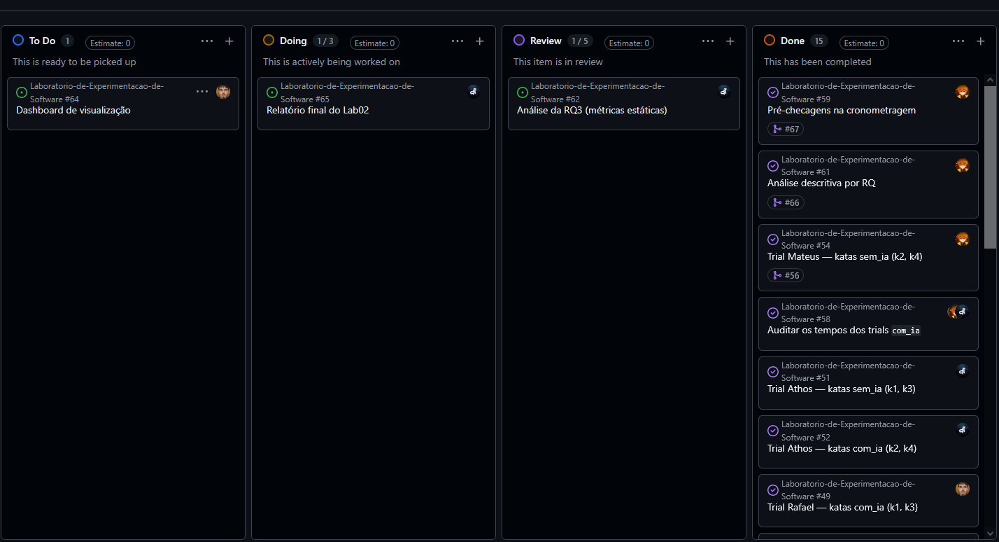

# Relatório de Laboratório

**Curso:** Engenharia de Software  
**Disciplina:** Laboratório de Experimentação de Software  
**Turno / Período:** Noite / 6º Período  
**Professor(a):** Danilo Maia  
**Laboratório:** Lab02 - Assistentes de IA vs. Codificação Manual  
**Grupo (trio):** Athoosz · mateusdsoc · RafaelMouraG  
**Link do repositório / GitHub Projects:** [https://github.com/users/RafaelMouraG/projects/7](https://github.com/users/RafaelMouraG/projects/7)  
**Data de entrega:** 25/09/2026  

---

## 1. Introdução

Ferramentas de IA generativa tornaram-se onipresentes no desenvolvimento de software, no entanto, ainda há pouca evidência controlada e reproduzível sobre seu real impacto em produtividade e qualidade (a maior parte do que se avalia baseia-se em evidência anedótica). Este laboratório investiga quantitativamente os efeitos do uso de um assistente de IA na resolução de tarefas de programação, através do acompanhamento de métricas de tempo, sucesso e manutenibilidade estrutural. 

As Questões de Pesquisa (RQs) do estudo e suas respectivas hipóteses informais antes da coleta são:

**RQ1. O uso de assistente de IA reduz o tempo necessário para resolver uma tarefa de programação?**
- **H0:** O tempo mediano de resolução com IA é *maior ou igual* ao tempo manual ($T_{IA} \ge T_{Manual}$).
- **H1:** O tempo mediano de resolução com IA é *menor* que o tempo manual ($T_{IA} < T_{Manual}$).

**RQ2. O uso de assistente de IA reduz a quantidade de defeitos (testes que falham) no código produzido?**
- **H0:** A taxa mediana de sucesso nos testes com IA é *menor ou igual* à da codificação manual ($S_{IA} \le S_{Manual}$).
- **H1:** A taxa mediana de sucesso nos testes com IA é *maior* do que na codificação manual ($S_{IA} > S_{Manual}$).

**RQ3. O uso de assistente de IA altera a complexidade ciclomática ou a duplicação do código produzido?**
- **H0:** Não há diferença estatisticamente significativa na complexidade ciclomática mediana e na duplicação de código entre as abordagens ($C_{IA} = C_{Manual}$).
- **H1:** Há diferença estatisticamente significativa na complexidade ciclomática mediana e/ou na duplicação de código entre as abordagens ($C_{IA} \ne C_{Manual}$).

**Inovação proposta (30%):** Além das métricas fundamentais exigidas (Tempo, Taxa de Sucesso, Complexidade e Duplicação), propomos a aferição do **Índice de Manutenibilidade (MI - Maintainability Index)** como métrica composta adicional para a RQ3.

## 2. Contexto

Este laboratório insere-se na S02 do projeto e consiste na execução controlada de *Katas* (exercícios de programação de dificuldade padronizada) em Python. A metodologia baseia-se num experimento *crossover within-subject* contrabalanceado (cada membro atua como controle de si mesmo, resolvendo parte dos katas manualmente e parte com auxílio da IA). 

Como base teórica, as métricas deste estudo foram modeladas seguindo a abordagem GQM (Goal-Question-Metric) descrita por Basili, Caldiera & Rombach, estabelecendo os vínculos claros entre o objetivo macro (medir IA vs Humano) e a coleta instrumental via código. A ferramenta de IA eleita para todos os trials assistidos foi o **Claude** (da Anthropic), para uniformizar o contexto experimental de todo o trio.

## 3. Metodologia

### 3.1 Principais Desafios
Durante a fase de execução (Sprint 02), três grandes desafios e desvios (#60) afetaram a fluidez e precisão do laboratório:
1. **Sensibilidade do Parser de Duplicação:** A ferramenta de duplicação (`jscpd`) não obteve volume de *tokens* ou linhas o suficiente para encontrar clones, dado que as respostas aos *katas* foram curtas (10 a 20 linhas).
2. **Tempo Viciado por Extração "One-Shot":** Os tempos capturados na abordagem "com IA" foram irrealisticamente baixos (mediana ~41s), pois a interação resumiu-se ao desenvolvedor copiar e colar o problema inteiro para a IA, e em seguida colar a solução *one-shot* de volta no editor. 
3. **Correção de Teste de Aceitação:** Encontrou-se uma falha/ambiguidade estrutural no Kata 2 durante o processo de execução manual, que demandou correção extra, aumentando artificialmente a carga horária deste trial em específico.

### 3.2 Tomadas de Decisão
- **Uso da Mediana e IQR:** Devido ao tamanho extremamente pequeno da amostra (12 trials no total) e ocorrência de outliers isolados, todas as consolidações adotaram a mediana e o IQR em vez de média e desvio padrão.
- **Teste de Wilcoxon:** Escolhemos o teste pareado de Wilcoxon, ideal para amostras não-paramétricas e experimentos *within-subject*.
- **Censura no Time-box:** Fixamos o *time-box* cravado em 35 minutos. Qualquer limite atingido não resultaria em exclusão (o que beneficiaria artificialmente os resultados com mais falhas), mas sim no registro censurado do trial com tempo 2100s.
- **LOC como Variável de Controle Obrigatório:** Adotamos o tamanho bruto (`loc`) como contra-peso nas métricas estáticas, pois os códigos de IA mostraram-se marginalmente mais prolixos, o que invalida uma leitura cega da complexidade ciclomática.

### 3.3 Etapas
A divisão de tarefas obedeceu ao pareamento no GitHub Projects. Uma visão das etapas de desenvolvimento:

| Sprint | Entregas | Responsável(is) |
|---|---|---|
| **Lab02S01** | Desenho do experimento e scripts (cronometragem, métricas). | Athoosz, RafaelMouraG, mateusdsoc |
| **Lab02S02** | Execução do experimento (Katas alternados com e sem IA). | Athoosz, RafaelMouraG, mateusdsoc |
| **Lab02S03** | Análise estatística Wilcoxon e visualização gráfica. | Athoosz, RafaelMouraG, mateusdsoc |
| **Relatório** | Construção do relatório consolidado e evidências finais. | Athoosz, RafaelMouraG, mateusdsoc |

### 3.4 Ferramentas
- **Linguagem / IDE:** Python 3 (ambientes de edição configurados sem extensões de IA intrusivas nos cenários sem IA).
- **Testes:** `pytest` integrado ao script de cronometragem `src/cronometragem.py`.
- **Métricas Estáticas:** `radon` (complexidade `cc`, raw `loc` e maintainability index `mi`) e `jscpd` (duplicação).
- **IA Generativa:** Claude (Anthropic). *(Interface e versão utilizadas: [Preencher modelo e interface])*
- **Análise Estatística:** Scripts em Python, utilizando validação do teste exato de Wilcoxon.
- **Gestão:** GitHub Projects (v2).

### 3.5 Tabela de Métricas

| RQ | Métrica | Definição Operacional | Unidade | Ferramenta / Fonte |
|---|---|---|---|---|
| RQ1 | Time-to-green | Tempo percorrido até todos os testes passarem ou time-box ser atingido | Segundos | Script customizado (`cronometragem.py`) |
| RQ2 | Taxa de sucesso | % de testes unitários passando ao final do limite de tempo | Porcentagem | Saída do `pytest` no script |
| RQ3 | Complexidade média | Média da complexidade ciclomática de McCabe por função | Número | `radon cc` |
| RQ3 | Duplicação de código | Percentual de código idêntico que burla o limiar mínimo de tokens | Porcentagem | `jscpd` |
| 30% | Índice de Manutenibilidade | Fórmula de *Maintainability Index* do Halstead volume | Índice de 0 a 100 | `radon mi` |

### 3.6 Inovações Propostas pelo Grupo (30% da nota)
**Métrica adicional: Índice de Manutenibilidade (MI).**
Propusemos a coleta e a avaliação do MI através do pacote `radon mi`. O racional baseia-se na insuficiência da métrica de complexidade isolada. Ao injetarmos o Índice de Manutenibilidade, unimos num só número o volume de Halstead, a complexidade ciclomática e o fator LOC. A hipótese central foi avaliar se a resposta *one-shot* do Claude criaria rotinas mais "complexas" estruturalmente, mas simultaneamente compensadas em um código mais manutenível (MI maior).

## 4. Resultados

### 4.1 Coleta de Dados
A amostra final computou exatos **12 trials**. Não houve nenhum descarte de amostra nem dados ausentes.
Todos os *trials* foram finalizados antes do limite de tempo (0 censurados). Um outlier pontual na complexidade por linha (Athoosz/k3, valor 0.55) foi mantido, já que o método de Wilcoxon possui forte resiliência a picos isolados.

### 4.2 Visualização Gráfica

*[Inserir os gráficos Aqui, respondendo diretamente as RQs]*

**RQ1. O uso de assistente de IA reduz o tempo necessário para resolver uma tarefa de programação?**
`Insira aqui os graficos`

**RQ2. O uso de assistente de IA reduz a quantidade de defeitos?**
`Insira aqui os graficos`

**RQ3. O uso de assistente de IA altera a complexidade e a estrutura?**
`Insira aqui os graficos`

### 4.3 Discussão

- **RQ1 (Tempo):** A hipótese nula foi **rejeitada** ($p = 0.0156$). Houve uma redução expressiva do tempo (de 928,5s manual para 41,0s com IA).
- **RQ2 (Taxa de Sucesso):** A hipótese nula **não pôde ser rejeitada**. Como ambos os métodos obtiveram 100% de sucesso, o teste de Wilcoxon empata de maneira perfeita e reflete que os katas, por serem curtos, não excederam a capacidade manual da equipe em gerar zero bugs.
- **RQ3 e Inovação MI (Qualidade do Código):** A hipótese nula **não pôde ser rejeitada** ($p = 1.0$ para `cc_media`, $p = 0.84$ para o `mi` de inovação). A duplicação cravou 0% estatisticamente para todo o repositório.

A métrica inovadora (Índice de Manutenibilidade) manteve a mediana estática (88.98 com IA vs 88.63 sem IA). Isso nos provou que, dentro de Katas algorítmicos compactos, a diferença arquitetônica ou de clareza inserida pela IA não superou a margem de erro ou a competência estrutural padrão dos próprios pesquisadores em regime manual.

Quanto às **ameaças à validade**, os desvios registrados (#60) foram vitais. O contrabalanceamento incompleto concentrou possíveis benefícios de aprendizagem (Athoosz iterou primeiro duas vezes com IA, depois sem IA, criando fadiga invertida). Além disso, o tempo aferido de 41s na IA configura uma falha de construto: mensuramos não o processo de "desenvolver em dupla com a máquina", e sim a "velocidade de copiar *prompts* e transferir arquivos". A validade externa permanece restrita a projetos acadêmicos e katas *one-shot*.

## 5. Conclusão

O laboratório conseguiu evidenciar categoricamente a velocidade irrestrita com a qual uma IA generativa preenche respostas para algoritmos fechados (Katas). A queda de 15 minutos para ínfimos segundos consolida a capacidade da IA em tarefas padronizadas, ainda que essa medida seja uma proxy de interação bruta do modelo e não produtividade de arquitetura profunda.

Funcional e estruturalmente, as métricas de qualidade (testes, complexidade e o Índice de Manutenibilidade propício da nossa inovação) provaram-se inertes perante os cenários. Não se ganha manutenibilidade absurda, mas também não se infesta o código com complexidade espúria.

Como recomendações para o aprofundamento do estudo (futuro):
1. Expandir o objeto experimental para Katas com múltiplos arquivos ou domínios de arquitetura (e não puramente algoritmos de um único arquivo Python).
2. Substituir a IA como portal externo (Claude) por um copiloto inline, medindo de forma transparente a velocidade de predição e *pair-programming* sem a barreira do "copiar-colar" *one-shot*.

## 6. Referências
* BASILI, Victor; CALDIERA, Gianluigi; ROMBACH, H. Dieter. The goal question metric approach. 1994.
* LAB02. Enunciado e documentação oficial da disciplina. 2026.
